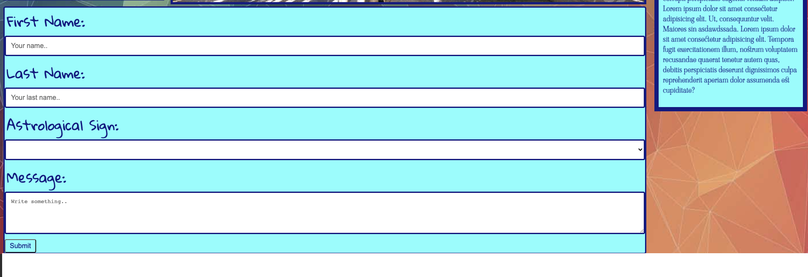

# My Portfolio

## A responsive portfolio using CSS and HTML
My goals when creating this portfolio was to showcase the work to the potential employer. Various aspects of the page are interactable and allow the user to easily navigate to each part of the page. 

This portfolio consists of the follow sections.
Header/Nav bar
"My work"
"About me"
"Conact me"

## [Link to deployment](https://kcmuse.github.io/portfoliohw2/)

## Below is a preview of the website

